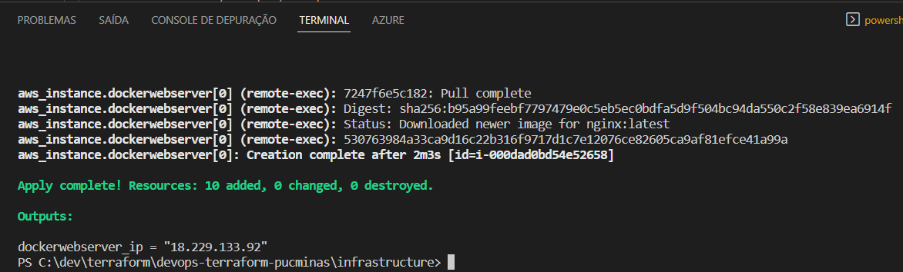
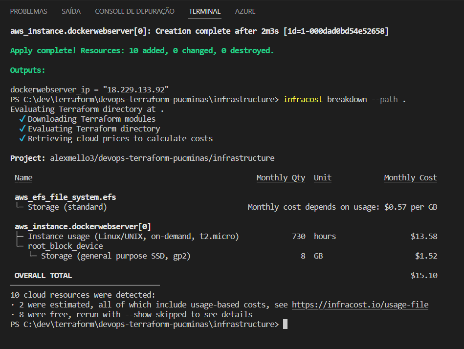
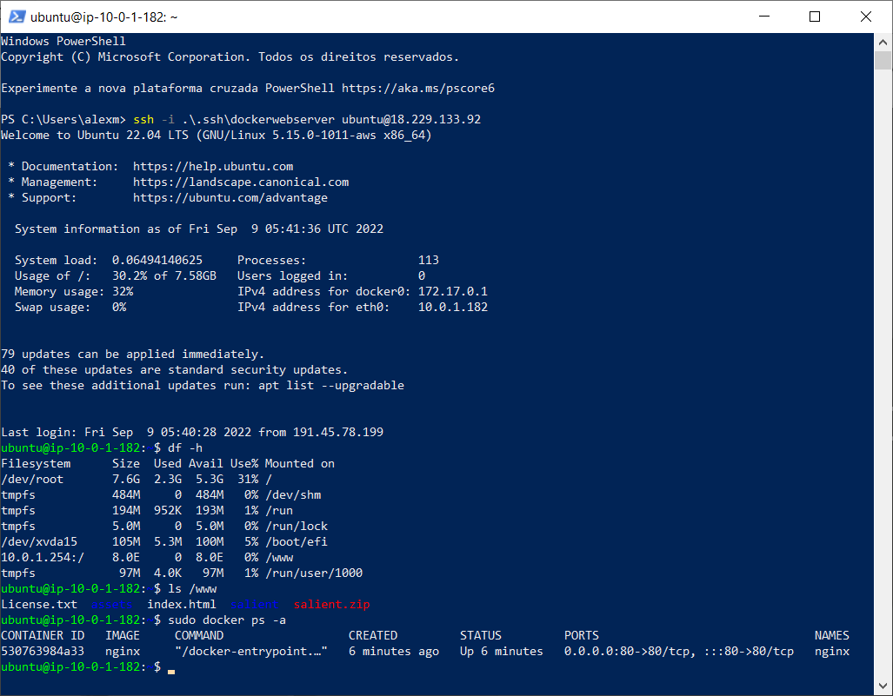

# devops-terraform-pucminas
### Trabalho do curso de pós graduação em Arquitetura de Soluções

<b>Professor:</b> Westerley da Silva Reis

<b>Alunos:</b> Alex Mello de Mendonça e Pedro Henrique Silva Pinho

<b>Curso:</b> Pós Graduação em Arquitetura de Soluções

<b>Disciplina:</b> Cultura e Práticas DevOps

### Objetivo do Trabalho

Usar o Terraform para criar uma infraestrutura como código, aplicar a infraestrutura na AWS e expor um website. A infraestrutura é composta de VPC, Internet Gateway, Subnet, Rotas, Security Groups, EC2 e EFS. Dentro do EC2 roda um docker com um servidor NGINX, que expõe um site armazenado no volume EFS montado na máquina virtual.

Com o simples comando <b>terraform apply</b> toda a infraestrutura é levantada na AWS, o Docker é instalado, a imagem do NGINX é executada, o site é enviado para o volume EFS e exposto na porta 80 do EC2.

### Evidências

<b>Comando "terraform apply" com sucesso e endereço IP do EC2</b>

<b>Infracost - Detalhando o custo da infraestrutura como código executando na AWS</b>

<b>Logando no EC2 via SSH, mostrando detalhes do volume EFS montado em /www e mostrando o conteiner rodando no Docker</b>

<b>Website sendo exposto na porta 80 e abrindo no browser</b>

